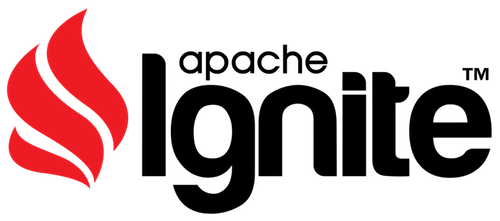

# mm-ADT
## A Cluster-Oriented Virtual Machine Architecture

---

<a href="assets/images/posters/sculpture-classes.jpg"></a> The mm-ADT virtual machine integrates processing engines and storage systems across a distributed compute cluster. The virtual machine's processor abstraction integrates with the <a href="https://en.wikipedia.org/wiki/Reactive_programming">reactive pattern</a>, the <a href="https://en.wikipedia.org/wiki/Actor_model">actor model</a>, and various asynchronous/batch <a href="https://en.wikipedia.org/wiki/Message_passing">message-passing</a> architectures. Processors implement a core set of primitive functional operations that are composed into semi-cyclic _instruction graphs_ called programs (or queries). Program instruction graphs guide swarms of traverser-<a href="https://en.wikipedia.org/wiki/Monad_(functional_programming)">monads</a> over data sorted by a traverser-computable <a href="https://en.wikipedia.org/wiki/Type_system">type system</a> whose programs are compiled by traversers using <a href="https://en.wikipedia.org/wiki/Abstract_interpretation">abstract interpretation</a>. mm-ADT type definitions can be constrained to instruction subsets that delineate the computational boundaries between canonical-types, <a href="https://en.wikipedia.org/wiki/Refinement_type">refinement-types</a>, <a href="https://en.wikipedia.org/wiki/Dependent_type">dependent-types</a>, and ultimately "Turing types" which leverage looping and branching instruction combinators that enable universal computing over data systems ranging from databases w/ random access data paths to distributed file-systems optimized for linear-access data processing. 

---

## The Structures of Obj

The base structure of mm-ADT is `obj`&mdash;object. Diagrammed below are the 7 fundamental, _built-in_ types. Custom _derived types_ can be defined by combining and constraining the built-in types. mm-ADT provides a collection of generally useful derived types such as `short`, `long`, `varchar`, `complex`, `pair`, etc. Users will typically define domain-specific types such as `person` or `company`.

<center>

</center>

<br/>
Every `obj` is a _carrier_ in an [algebraic structure](https://en.wikipedia.org/wiki/Algebraic_structure). The set of operators that each type draws from are denoted by the symbols `*`, `+`, `/`, `-`, `&`, `|`, and `!`. Along with operators, a type can specify a `0` and/or `1` identity element. The meaning of these symbols is [_overloaded_](https://en.wikipedia.org/wiki/Operator_overloading) in that each type specifies its own operator semantics. The default algebraic structures for the built-in types are provided in the table below.

| type   | algebraic structure         | operators               | identities              |
| :------|:--------------------------- | :---------------------- | :-------------------- |
| `bool` | commutative [ring](https://en.wikipedia.org/wiki/Ring_(mathematics)) with unity | `*`,`+`,`-`,`&`,`|`,`!` | `0=>false`,`1=>true`  |
| `int`  | commutative [ring](https://en.wikipedia.org/wiki/Ring_(mathematics)) with unity | `*`,`+`,`-`             | `0=>0`,`1=>1`         |
| `real` | [field](https://en.wikipedia.org/wiki/Field_(mathematics))                      | `*`,`+`, `/`, `-`       | `0=>0.0`,`1=>1.0`     |
| `str`  | synthetic [group](https://en.wikipedia.org/wiki/Group_(mathematics))            | `+`,`-`                 | `0=>''`               |
| `list` | synthetic [group](https://en.wikipedia.org/wiki/Group_(mathematics))            | `+`,`-`                 | `0=>[]`               |
| `rec`  | synthetic [group](https://en.wikipedia.org/wiki/Group_(mathematics))            | `+`,`-`                 | `0=>[:]`              |
| `inst` | [ring](https://en.wikipedia.org/wiki/Ring_(mathematics)) with unity             | `*`,`+`,`-`,`&`,`|`     | `0=>[none]`,`1=>[id]` |

<br/>
An algebraic structure defines a set of axioms whose entailments yield theorems. In mm-ADT, theorems are used by the virtual machine to perform [type checking](https://en.wikipedia.org/wiki/Type_system#Type_checking), [type inference](https://en.wikipedia.org/wiki/Type_inference), and program optimization. Furthermore, via the constructs of _model-ADTs_ and _embeddings_, different algebraic structures (which ultimately use the same fundamental types as carriers) can be defined and mixed within the same computation. Models specify isolated algebraic environments and rules for moving between them. In the lexicon of [category theory](https://en.wikipedia.org/wiki/Category_theory), models are _categories_ and embeddings are [_functors_](https://en.wikipedia.org/wiki/Functor). Thus, the "default algebraic structures" specified in the table above are understood to be a collection of models denoted `mm`&mdash;the core model-ADT from which all other models are ultimately derived.

```groovy
mmadt> true | false             // bool or
==>true
mmadt> true + true              // bool exclusive or
==>false
mmadt> 'mar' + 'ko'             // str concatenation
==>'marko'
mmadt> ['a':1,'b':2] - ['a':1]  // rec retraction
==>['b':2]
mmadt> 'hey' + 42               // int is first embedded in str
==>'hey42'
```

---

## The Processes of Inst

An mm-ADT object is a static structure. A process is required to transform objects. All processes are described by the `inst` ring, where `*` is serial instruction composition (compose) and `+` is parallel instruction composition (branch). Thus, `inst` is unique in that it bridges the static world of structure and the dynamic world of process to yield the phenomena of _computing_.

The mm-ADT virtual machine's [instruction set](https://en.wikipedia.org/wiki/Instruction_set_architecture) architecture is defined by the elements of `inst`. The table below itemizes the 7 base instructions that all other instructions can be written in terms of. Note that there also exists a set of _machine_ instructions for configuring the virtual machine (and its associated components) and thus, exist outside the described theortical framework.

| instruction  | signature     | description                                                             |
| :----------  | :------------ | :---------------------------------------------------------------------- |
| `[map]`      | `X -> Y`      | Transform an element of `X` to an element of `Y`.                       |
| `[filter]`   | `X -> X{?}`   | Transform an element of `X` to itself or nothing.                       |
| `[flatmap]`  | `X -> Y{*}`   | Transform an element of `X` to zero or more elements of `Y`.            |
| `[reduce]`   | `X{*} -> X`   | Transform zero or more elements of `X` to an element of `X`.            |
| `[barrier]`  | `X{*} -> Y{*}`| Transform zero or more elements of `X` to zero or more elements of `Y`. |
| `[initial]`  | `X{0} -> X`   | Transform nothing to an element of `X`.                                 |
| `[terminal]` | `X -> X{0}`   | Transform an element of `X` to nothing.                                 |

<br/>
The _mmlang_ assembly language (distributed with mm-ADT) provides some human-friendly [syntactic sugar](https://en.wikipedia.org/wiki/Syntactic_sugar) which are compiled to `inst`&mdash;the algebraic structure used by the mm-ADT VM to compute. For instance, the first three expressions below ultimately compile to the final expression. The second expression best demonstrates an embedding. It takes the `str` `'mar'` to the `inst` `[start,'mar']`, where `*` in the `inst` ring then enacts a serial composition with `[plus,'ko']`.

```groovy
mmadt> 'mar' + 'ko'
==>'marko'
mmadt> 'mar' * [plus,'ko']
==>'marko'
mmadt> [start,'mar'] * [plus,'ko']
==>'marko'
mmadt> [start,'mar'][plus,'ko']
==>'marko'
```

<center>

</center>

---

## The Embeddings of Model

The mm-ADT virtual machine was designed for cluster computing, where structures are distributed and processes are parallelized across any number of physical machines. The systems that store structures are databases and the engines that process instructions are stream pipelines. The database industry classifies its databases by their [abstract data type](https://en.wikipedia.org/wiki/Abstract_data_type) (ADT). Examples database ADTs include relational, graph, key/value, and document. mm-ADT provides a set of _model-ADT embeddings_ that define popular database ADTs in terms of mm-ADT objects.

### A Key/Value Store Example

A model-ADT is stored on the virtual machine using `[model]` (a machine instruction). A key/value model-ADT is define below. This model defines 4 types: a key (`k`), a value (`v`), a key/value pair (`kv`), and the store as a whole (`kvstore`). A key is any `obj`, a value is any `obj`, and a key/value pair is a `list` with the first element being a key and the second element being a value. Finally, `kvstore` (which is not coincidentally also the name of the model) is understood as the "root" object of the database and is defined as zero or more key/value pairs. 

```groovy
[model,kvstore,
 [define,k,       obj]
 [define,v,       obj]
 [define,kv,      [k;v]]
 [define,kvstore, kv{*}]]
```

A model contains both types and the instructions that map between them. The example above is elaborated upon below with the addition of 4 instruction [rewrite rules](https://en.wikipedia.org/wiki/Rewriting). If a program tries to remove an element of a key/value pair, then an error is thrown. Similarly, if a program tries to change a key/value pair's key, an error is thrown. Next, the stream of zero or more key/value pairs typed as `kvstore` must never contain duplicate keys and thus, a `[dedup]` on keys yields a rewrite to a [no-op](https://en.wikipedia.org/wiki/NOP_(code)) which simply removes the instruction from the program. Finally, when a new key/value pair is written to the store, a pair with an equivalent key is searched for and updated. If no such key/value pair exists, then the provided key/value pair is added to the stream (i.e. the database). 

```groovy
[model,kvstore,
 [define,k,       obj]
 [define,v,       obj]
 [define,kv,      [k;v]
  -> [drop,0|1]           => [error]
  -> [put,0,k]            => [error]]
 [define,kvstore, kv{*}
  -> [dedup,[get,0]]      => 
  -> [plus,[k~a;v~b]]     => [coalesce,
                               [is,[get,0][eq,a]][put,1,b],
                               [plus,[id]]]]]
```

<a href="http://ignite.apache.org"></a> The `kvstore` model-ADT defines an abstract data type that must ultimately be physically implemented by a database capable of encoding the requisite structures and their respective denotational semantics. The [Apache Ignite](https://ignite.apache.org/) project team develops a distributed key/value database called Ignite. In order for the mm-ADT VM to work over Ignite, a model-ADT must be defined that maps the constructs of Ignite to those of `kvstore` and thus, mm-ADT. The `ignite` model is defined below, where the set of possible keys and values are constrained. The `ignite` type extends `kvstore`. If Ignite is configured to sort its key/value pairs in ascending order by key, then a no-op occurs. If the number of key/value pairs is requested via `[count]`, each node in the cluster will linearly iterate its entire key/value pair partition to compute a distributed count reduction. However, if this count can be computed more efficiently by Ignite (e.g. in less than `O(n)`), then `[count]` is rewritten to a `[map]` instruction that transforms the key/value stream (as a whole) to a single `int`. This `int` is dereferenced using the instructions on the right hand side of the _maps from_-token (`<=`), where `[=]` is a machine instruction that manages the connection between the VM and its integrated components (e.g. the Ignite cluster). An `[eval]` machine instruction issues an Ignite-specific [remote procedure call](https://en.wikipedia.org/wiki/Remote_procedure_call) (RPC) that offloads the count calculation from the VM's integrated processors to Ignite. Finally, the last rewrite rule below leverages database indices in an analogous manner to the aforementioned `[count]` rewrite.

```groovy
[model,ignite,
 [define,k,      kvstore.k  & (int|str)]
 [define,v,      kvstore.v  & (bool|int|real|str|list)]
 [define,kv,     kvstore.kv & [k;v]]
 [define,ignite, kvstore  <= [eval,'connect',['ip'   :'127.0.0.1',
                                              'port' :10800,
                                              'cache':'example']]
  -> [order,[gt,[get,0]]] =>
  -> [count]              => [map, int   <=[=ignite][eval,'store-size']]
  -> [is,[get,0][eq,k~a]] => [map, kv{?} <=[=ignite][eval,'idx-query',a]]]]
```

---

## Conclusion

<a href="/"></a> The mm-ADT virtual machine can integrate any number of heterogeneous processing engines and storage systems into a universally configurable data processing platform. This amalgamation is made possible via the construct below which specifies a _type_ (set) and the instructions necessary to manifest its _instances_ (elements) within the mm-ADT address space. Its power comes from the fact that there is no fundamental distinction between a _type_ and an _instance_ in mm-ADT. An instance is simply a type that defines itself.  While `obj` and `inst` may not always be explicitly coupled via `<=`, it is always there (e.g. via type inferencing). Expressions of this form represent the boundary between structure and process.

```groovy
obj <= inst
```