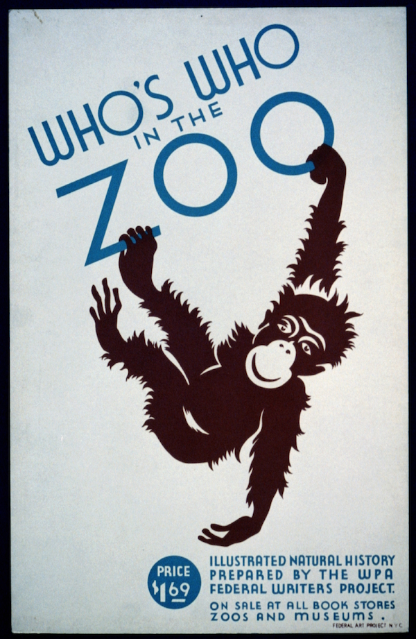

# mm-ADT
## An Open Source Infrastructure

---

The mm-ADT open source model is an attempt to create a technology-driven, economic infrastructure for _micro-entrepreneurial_ developers. While the <a href="/">home page</a> itemized a collection of worthwhile VM-centric language, processor, and storage projects, there will necessarily be a number of infrastructure projects associated with maintaining and simplifying the distributed, self-governed aspect of mm-ADT as a whole. Like all mm-ADT projects, revenue models for infrastructure projects is determined by the projects themselves.

## Cloud Computing

Cloud computing services make software deployment and licensing easier with pre-configured images and pay-as-you-go billing. An mm-ADT project dedicated to packaging the mm-ADT VM and its associated technologies for use with the major cloud vendors would open mm-ADT projects to new licensing models and income streams. Most importantly, the mm-ADT cloud computing team would benefit from being at the forefront of a potentially large source of revenue.

[Amazon AWS](https://aws.amazon.com): Amazon's cloud computing services.  
[Google Cloud](https://cloud.google.com/): Google's cloud computing service.  
[Microsoft Azure](https://azure.microsoft.com/): Microsoft's cloud computing service.  

## Accounting

...

