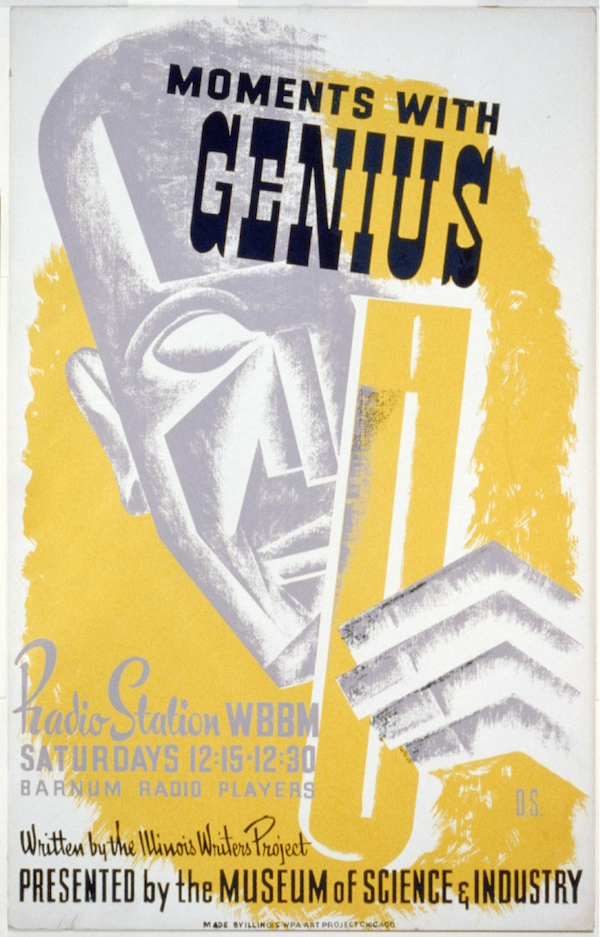
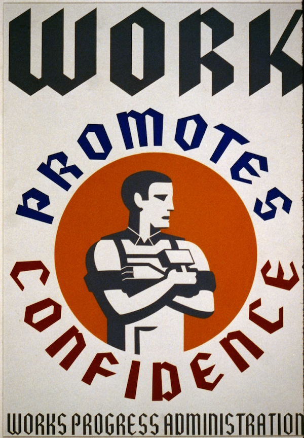
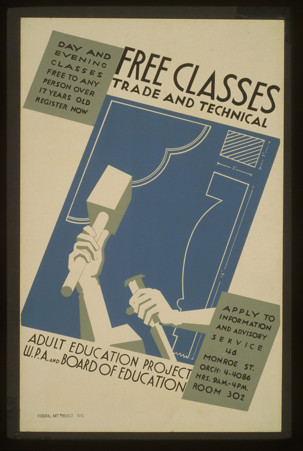
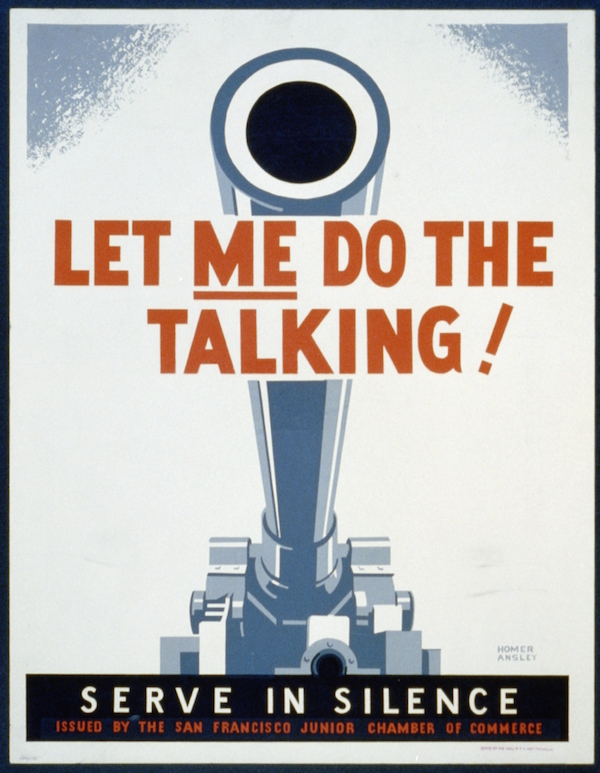
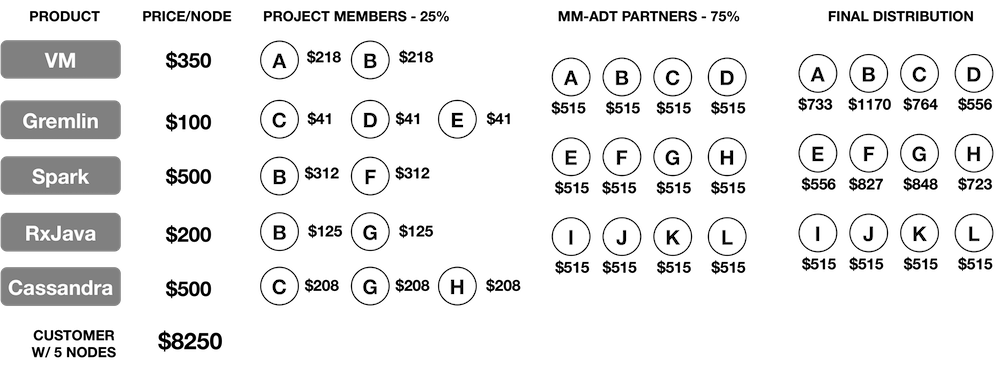

# mm-ADT
## A Career-Centric Open Source Model

---

The mm-ADT Open Source Model is currently under development. When a stable working process is realized, this disclaimer will be removed and the contents of this page will form v1.0 of the mm-ADT governance structure. Early on, in order to help surface the inevitable complications associated with a revenue-based open source model, selected developers in the community will be invited to submit a public facing mm-ADT project.

Last Updated: October 29, 2019

---

mm-ADT&#8482; is composed of professional developers collaborating on and across any number of self-governed, open source projects. Project members define, develop, support, and market their projects' products. Revenue is generated from product licensing. {{ page.member_distro }} of a product's revenue is evenly distributed amongst the project members. The remaining {{ page.partner_distro }} is equally distributed amongst all mm-ADT partners. 

--- 

## People

mm-ADT products are produced and consumed by people and companies. The specific roles these actors play are identified below and will be referred to throughout the remainder of this document.

**User**: A consumer of mm-ADT technology.  
&nbsp;&nbsp;**Contributor**: A user offering mm-ADT features, patches, and support.  
&nbsp;&nbsp;**Customer**: A user with an mm-ADT commercial license.  
**Partner**: A producer of an approved mm-ADT project.  
&nbsp;&nbsp;**Member**: A partner in the context of a particular project.  

Each mm-ADT project's GitHub repository must be connected with <a href="https://www.clahub.com/">CLAHub</a>. All contributors and partners are required to sign the project's ICLA (or CCLA) before committing source code.

**ICLA**: Individual Contributor License Agreement (example ICLA for <a href="https://www.clahub.com/agreements/mm-adt/vm">mm-ADT VM</a>).  
**CCLA**: Corporate Contributor License Agreement.

---

## Projects
 The mm-ADT virtual machine ([mm-ADT VM](http://vm.mm-adt.org/)) is the founding project that is responsible for defining the protocols and tooling by which all other mm-ADT projects integrate.

* Every project has an <a href="https://github.com/mm-adt">mm-ADT GitHub repository</a>.  
    * All repositories are hosted in the mm-ADT GitHub organization (example repository for <a href="https://github.com/mm-adt/vm">mm-ADT VM</a>).
* Every project has a namespace structured as `xyz.mm-adt.org`.  
    * Namespaces are managed via DNS CNAMES and <a href="https://redirect.name">redirect.name</a>.  
* Every project has a homepage with documentation.

* Every mm-ADT project has a public and a private mailing list.  
  * Public mailing lists are how creators discuss development.  
  * Private mailing lists are how creators discuss internal politics.  
  * The mm-ADT VM private mailing list is the internal communication forum for all mm-ADT partners.  

* Every mm-ADT project supports its users via <a href="https://stackexchange.com/users/16990143/mm-adt">mm-ADT StackOverflow</a>.

* Every mm-ADT project has a Slack channel in <a href="https://mm-adt.slack.com/">mm-ADT Slack</a>. 

### Project Creation
Any user can propose a project to the mm-ADT VM public mailing list via a`[DISCUSS]` posting. The act of proposing a project makes the user a contributor. After a thorough discussion of the proposal, the contributor can request that their proposal go to `[VOTE]`. The project is voted on the mm-ADT VM private mailing list. Votes are expressed using -1, 0, or +1 with the voting window lasting 1 week. The votes are tallied and the result is either positive (approved), neutral (delayed), or negative (denied). 

If the final `[VOTE]` is positive, then a private repository is created for the project. The project is maintained in a public repository (labeled _incubating_) until its debut release. A project's first *two* product releases require a positive `[VOTE]` from the project members on their project's private mailing list and then a positive `[VOTE]` from all mm-ADT partners (via the mm-ADT VM private mailing list). All subsequent releases only require a positive `[VOTE]` from the project members.

A contributor becomes an mm-ADT partner when their project receives revenue.

---

## Products

The project members must provide the following items before a release.

#### Product Distribution Package

Maven3-based projects should use <a href="https://creadur.apache.org/rat/">Apache Rat</a> to verify copyright notices (see example <a href="https://github.com/mm-adt/vm/blob/master/java/pom.xml#L118-L157">pom.xml</a>).

#### Product List Price

* Partners are responsible for setting product pricing.
* The license cost is finalized with a `[VOTE]` amongst the project members.
* A commercial license is valid for 3 months.

| Component          | Licensing Cost         |
| :----------------- | :--------------------- |
| Language Compilers | `$X * #nodes`          |
| Processing Engines | `$Y * #nodes`          |
| Storage Systems    | `$Z * #nodes`          |  

 

#### Product Revenue Distribution

* Revenue is distributed within 45 days of receipt of customer invoice payment.
* {{ page.member_distro }} of a product's revenue is distributed equally amongst the project members.
  * The project members at the time of receipt of payment receive distributions.
* {{ page.partner_distro }} of a product's revenue is distributed equally amongst all mm-ADT partners.
  * The partners at the time of receipt of payment receive distributions.
* Partners are paid via <a href="https://www.paypal.com/">PayPal</a>.
  * Developers in the United States must have a <a href="https://en.wikipedia.org/wiki/Form_1099-MISC">1099-MISC</a> in place with RReduX,Inc.

