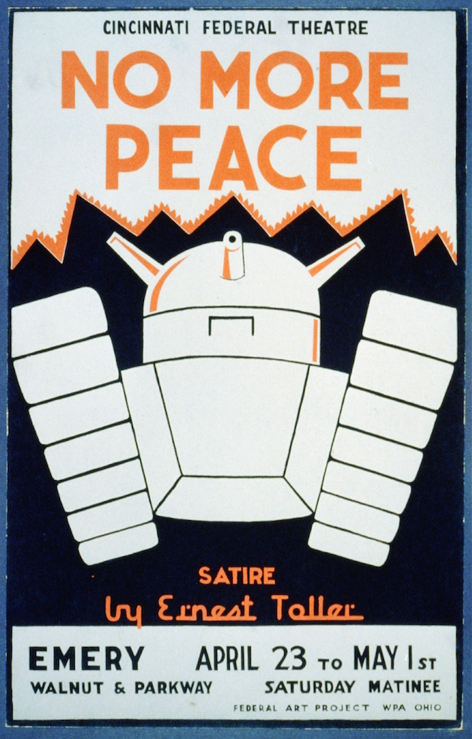

# mm-ADT
## An Open Source Perspective

---

Open source software development is no longer the toil of the "hobbyist." The open source models that were developed 20 years ago are unable to address the contemporary social and economic issues that developers currently face. The mm-ADT open source model offers world-class developers an economic experience that is intended to be more natural, sustainable, and aimed at satisfying the ultimate desire: to live comfortably while pursuing further mastery of the trade.

## The Plight of the Free Open Source Developer 

### Independent Open Source Developers Suffer Economically

Independent open source developers spend their time developing software that provides no financial compensation and, paradoxically, as the popularity of their project increases, success can lead to burnout and financial ruin. 

### Corporate Open Source Developers Sacrifice Autonomy 

Corporate open source developers are in the problematic situation where their work is dependent on their sponsoring organization who also controls the direction and pace of development as well as the interoperability and inclusion of any novel innovations within the project.

### Entrepreneurial Open Source Developers Lack a Competitive Edge

Entrepreneurial open source developers may form a company around their open source project. Unfortunately, such companies are easily obviated in the market because the core product is freely licensed and competing firms can offer the same product without having to invest in the research and development effort.

---

## The Role of Corporations in Open Source Software

### Open Source Software Isn't Free

The free availability of open source software has led to the erroneous impression that software does not have an intrinsic value. The consequence has been the creation of technology companies with _inverted_ business models based on support contracts, premium features, and other solutions auxiliary to the primary source of value&mdash;the open source core.

### World-Class Developers Are Product Evangelists

The free open source software foundations require developers to define, create, document, support, and market their technology. Through project mailing lists, social media site, blogs, as well as via conference speaking engagements and academic articles, open source development teams are well-rounded _value creating machines_.

### Corporate Infrastructure Is An Unnecessary Cost

Corporate management structures are an unnecessary appendage to a world-class software development team. This has been proven time and again by the high-quality, self-governed projects of the open source software foundations. Likewise, marketing and sales structures make less sense when projects naturally sell themselves by being well documented, promoted, and where the source can be reviewed, downloaded, integrated, tested, and benchmarked all prior to adoption by the consumer.

---

## The Benefits of a Developer Driven Platform

### The Free Market Determines Product Value

mm-ADT seeks to create a simple, fair open source economy devoid of contorting financial mechanism such as investors, stock options, bonuses, raises, performance reviews, power hierarchies, and other complications that obfuscate both the technology and individual's true worth. mm-ADT empowers developers by offering them direct access to the free and open market. 

### Interoperability Enables Deeper Specialization

mm-ADT integrates open source data projects into a general-purpose data processing platform. For developers, ease of integration means the freedom to specialize as contributions will integrate with other mm-ADT technologies. For commercial organizations, it should be easier to expand product offerings and stay relevant as the underlying data technologies rise and fall in popularity. The benefits to the user are that they can use their preferred query language to control an assortment of specialized processors to compute over storage systems appropriate to their application's data access requirements.

### Aligning Societal and Individual Incentives

Technological advancements occur when developers with unique skills and perspectives take technical risks. In the mm-ADT model, when such behaviors lead to successful outcomes, the developer is compensated in direct proportion to the value they created in the economy.