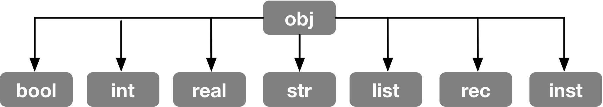

# mm-ADT
## A Cluster-Oriented Virtual Machine Architecture

---

The mm-ADT virtual machine has two primary functions. The first is to coordinate any number of processing engines and storage systems within a compute cluster. The second is to enable users to specify computations (i.e. queries or programs) to be executed across the cluster.

## The Obj

The most fundamental structure in mm-ADT is `obj`&mdash;object. There are 7 built-in/fundamental types that all behave as an `obj`, but also have their own characteristics. All other types are derived from these base types via combination or constraint. The mm-ADT standard library comes with a collection of common types such as `short`,`long`,`varchar`,`complex` and can also be defined by users to reflect their application domain such as `person`, `product`, etc.



Every `obj` is a _carrier_ for an algebraic structure. The default algebras for each data type are specified below.

* `bool`: a commutative ring with unity.
* `int`: a commutative ring with unity.
* `real`: a field.
* `str`: a monoid.
* `list`: ...
* `rec`: ...
* `inst`: an ring with unity.

## The Inst

There is special `obj` called `inst`&mdash;instruction.

```groovy
mmadt> 'mar' + 'ko'
==>'marko'
mmadt> 'mar' * [plus,'ko']
==>'marko'
```

## The Model
